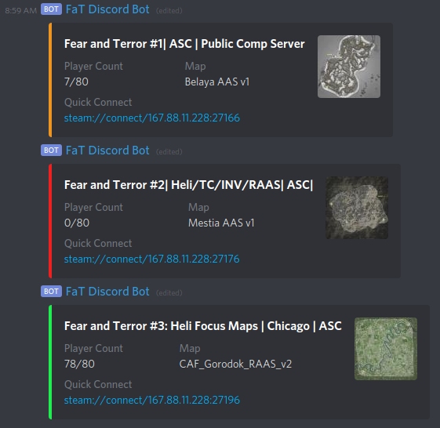

# Squad Tracker Bot
A Discord bot that tracks the current status of Squad or Post Scriptum servers.

### Warning
This repository is not really actively maintained and its only maintainer does not play Squad anymore.
The code here is rather old and certainly doesn't qualify as "good code" in several regards.
There currently aren't - and likely never will be - any plans to overhaul this codebase.

If something doesn't work, feel free to open an issue or message `Tim | w4rum#4344` on Discord but please be
understanding in case I don't find the time or motivation to provide you with extensive support.

## Overview
- **Server status message**.
The bot will post and update status messages in regular intervals in a
configurable channel for a configurable set of servers.

## Installation
1. Clone this repository
2. Install dependencies via `pip`:
    - Linux: `pip install -r requirements.txt`
    - Windows: `python3.exe -m pip install -r requirements.txt`
      (You might have to navigate to wherever your python installation
      is or add python to your `PATH` environment variable)
3. In the `squad_server_status_bot` directory, make a copy of
   `config-sample.py` called `config.py`
4. Change the config parameters.
   The default parameters are set up to match the Fear and Terror Discord (rest in peace)
   and Squad servers (also rest in peace).
   Settings that still need to be changed:
    - `BOT_TOKEN`: Discord Bot authentication token
