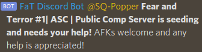
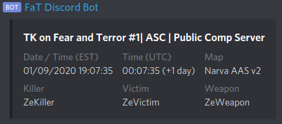

# Squad Tracker Bot
A Discord bot for the Fear and Terror Discord that tracks various activities on
the Fear and Terror Squad servers.

## Overview
- **Server status message**.
The bot will post and update status message in regular intervals in a
configurable channel for a configurable set of servers.

- **Pings for the seeding team**.
The bot will ping the seeding team at configurable times of day if any of the
server are not yet popped.

- **TK tracker**.
The bot will make a post in the TK channel for each team kill that occurs on
any of the servers.
To capture team kills, a small part of the bot (`tk_sender.py`) must be run
on the server machine.
The bot and the sending script communicate via an MQTT broker, allowing
mulitple sender and listener instances.

## Installation
1. Clone this repository to:
    - The machine the bot is supposed to run on
    - All server machines
    - If the bot runs on the same machine as any of the servers, you don't have
      to clone the repository twice
2. Install dependencies via `pip`:
    - Linux: `pip install -r requirements.txt`
    - Windows: `python3.exe -m pip install -r requirements.txt`
      (You might have to navigate to wherever your python installation is)
3. In the `squad_tracker` directory, make a copy of `config-sample.py`
   called `config.py`
4. Change the config parameters.
   The default parameters are set up to match the Fear and Terror Discord and
   Squad servers.
   Settings that still need to be changed:
    - `BOT_TOKEN`: Discord Bot authentication token
    - `MQTT_ADDRESS`: IP and port of the MQTT broker
    - `MQTT_(SUB|PUB)_(USER|PASSWORD)`: MQTT Login credentials for the TK
      listener and sender instances.
      For server-only clones, only the `PUB` options must be set.
      For the Discord bot clone, only the `SUB` options must be set.
